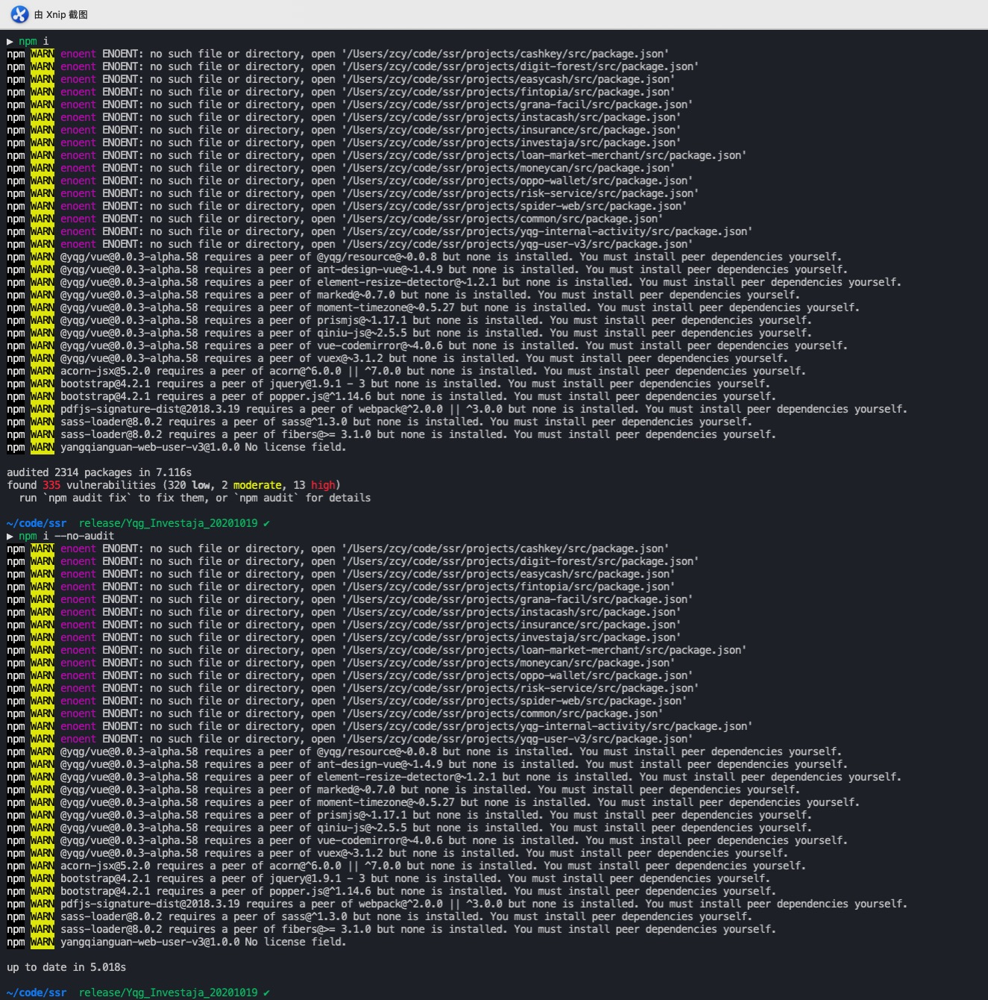

# 依赖处理
SPA与SSR均会先运行性一次`npm install --unsafe-perm`安装所有依赖，在build后进入build文件夹运行`npm i --production --unsafe-perm --no-audit --package-lock false`

所以对于spa项目来说所有页面依赖的库可以放在`devDependencies`中，而node依赖必须放在`dependencies`中

由于ssr项目在node端需要页面依赖来渲染页面所以页面依赖与node依赖均应放在`dependencies`中,只有一些构建依赖和只在客户端依赖运行的代码放在`devDependencies`中

---

# npm install参数
`npm i --production --unsafe-perm --no-audit --package-lock false`
## production
> Default: false
Type: Boolean
Set to true to run in “production” mode.
> 1. devDependencies are not installed at the topmost level when running local npm install without any arguments.
> 2. Set the NODE_ENV=”production” for lifecycle scripts.

只会安装`dependencies`字段中的依赖，`devDependencies`中的依赖不会被安装

## unsafe-perm
> Default: false if running as root, true otherwise
Type: Boolean
Set to true to suppress the UID/GID switching when running package scripts. If set explicitly to false, then installing as a non-root user will fail.

便于在使用root账户来运行npm

## no-audit

在通过npm官方源运行`npm i`的时候会默认向服务器请求包安全数据，如果使用这个参数则不会发送这个请求

## package-lock false
不使用package-lock，也不生成

